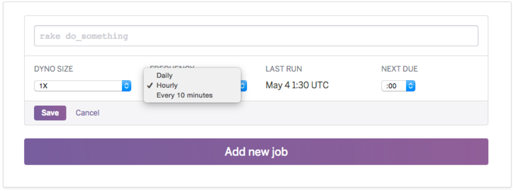

# KubeScheduledJob
_`kube-scheduled-job` is a Kubernetes job scheduler that is easy to use and manage._

## Origin

The original inspiration/impotus for this project was some organizational difficulty in making the jump from Heroku to Kubernetes. 

Heroku provides a free add-on that allows you to quickly and easily schedule recurring jobs/tasks using a GUI. Since tasks run off of your applications base image no additional configuration is necessary beyond the actual command to run and the schedule. 

## Features

- Run a recurring scheduled job based on an existing Deployment with no additional app config required.
- Run a recurring scheduled job based on any container in a Container Registry with independent config.
- Access logs for all jobs.
- Manage scheduled jobs via a UI or CLI.
- Easily visualize recent job run times and statuses in a monitoring dashboard.
- Exposed Prometheus `/metrics` scrape endpoint that individual jobs can push metrics to.
